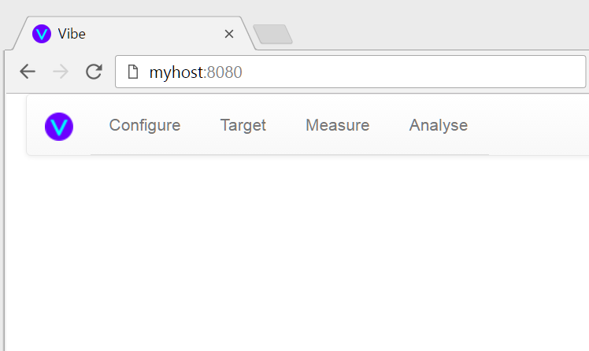

Installation
============

Bill of Materials
-----------------

Recorder
^^^^^^^^

* a Raspberry Pi model with wireless connectivity, this means the `pi3`_ or `pi zero w`_
* an rpi case that lets you access the GPIO pins, e.g. `the pibow`_
* a Micro SD Card

  * the rpi supports SDHC cards and the maximum size supported is 32GB
  * if the rpi is used for this purpose only, a large card is not really necessary though the price difference between a small card and a large card is pretty small
  * maximum read/write speed is about 25MB/s so there is no point spending on UHS3 cards
  * therefore buy any reputable class 10 card such as this `sandisk`_

* 1 `MPU-6050 IMU`_ per rpi
* `i2c cables`_
* a lightweight but secure mounting mechanism for attaching the board to the seat, I use `foam tape`_

Analyser
^^^^^^^^

*  any old computer with a network connection should do (including the rpi)

Prerequisites
-------------

Install an SSH Client
^^^^^^^^^^^^^^^^^^^^^

SSH is secure shell, it's a standard way to securely login to a remote (\*nix) host. You will need this to manage your rpi because an rpi runs linux.

Linux users should need no introduction to this.

MacOS users can familiarise themselves with the `terminal app`_

Windows users have to install a `3rd party client`_

Android users can consider an app like `connectbot`_ or one of the `many options on the play store`_

iOS users no doubt have something appropriate in their app store (`sample google search`_).

(Optional) Install an SCP Client
^^^^^^^^^^^^^^^^^^^^^^^^^^^^^^^^

scp means secure copy, it is a way to copy a file over a ssh connection. This may come in useful to get files to and from your rpi.

Note that you can scp via a terminal so if you ssh from a shell (the command line in windows speak) then you can also scp from that shell. Some users may prefer a graphical, explorer like, interface though such as `WinSCP`_.

Installing the Recorder
-----------------------

Setting up your rpi
^^^^^^^^^^^^^^^^^^^

These instructions use `raspbian`_ as the default rpi distro but any linux distro that has rpi support should work just
fine. The only real requirements are python 3.4+.

General reference installation instructions are available at https://www.raspberrypi.org/documentation/setup/ and should
be used as your main reference. This doc will just highlight the specific points we need to get running with the recorder.

1) `Install raspbian`_ onto your sd card
2) Assemble your rpi, plug in your sd card and connect up to a monitor
3) Boot up, you should be faced with a plain text login screen
4) Login as pi
5) Open `raspi-config`_

  * choose option 1 to provide access to the whole sd card
  * choose option 2 to change your password
  * choose option 7 and enable both ssh (so you can login remotely) and i2c (so it can talk to your MPU6050)

6) if you have more than 1 rpi then consider `renaming your pi`_
7) (Optional) Configure your rpi for `passwordless ssh access`_
8) Connect to your `wireless network`_, the instructions below are tested on the rpi3

  * open `/etc/network/interfaces`, it should contain::

      auto lo
      iface lo inet loopback

      iface eth0 inet manual

      allow-hotplug wlan0
      iface wlan0 inet manual
          wpa-conf /etc/wpa_supplicant/wpa_supplicant.conf
      allow-hotplug wlan1
      iface wlan1 inet manual
          wpa-conf /etc/wpa_supplicant/wpa_supplicant.conf

  * edit `/etc/wpa_supplicant/wpa_supplicant.conf` in your editor of choice to look like the following::

      ctrl_interface=DIR=/var/run/wpa_supplicant GROUP=netdev
      update_config=1
      network={
          ssid="<YOUR SSID>"
          psk="<YOUR PASSWORD"
      }

  * restart the networking service (or just reboot)
  * from a different machine, use your SSH client to check you can connect to the rpi from another machine via ssh::

      $ ssh pi@swoop

      The programs included with the Debian GNU/Linux system are free software;
      the exact distribution terms for each program are described in the
      individual files in /usr/share/doc/*/copyright.

      Debian GNU/Linux comes with ABSOLUTELY NO WARRANTY, to the extent
      permitted by applicable law.
      Last login: Wed Mar  1 22:35:38 2017 from 192.168.1.123
      pi@swoop:~ $

7) `Update raspbian`_ to bring everything up to date
8) (Optional) Allocate a `static IP to your rpi`_ and add it to your hosts file on your main PC
9) (Optional) Set a new `hostname for your rpi`_

.. _install-mpu6050-wiring:

Wiring up the MPU6050
^^^^^^^^^^^^^^^^^^^^^

1) disconnect your rpi from the screen and powerdown
2) connect your MPU6050, remember to wire as per `this wiring example`_
3) boot up
4) install `i2c-tools`::

    $ sudo apt install i2c-tools

5) follow the i2c section of `this guide`_, if everything is functioning correctly the result should be::

    $ i2cdetect -y 1
         0  1  2  3  4  5  6  7  8  9  a  b  c  d  e  f
    00:          -- -- -- -- -- -- -- -- -- -- -- -- --
    10: -- -- -- -- -- -- -- -- -- -- -- -- -- -- -- --
    20: -- -- -- -- -- -- -- -- -- -- -- -- -- -- -- --
    30: -- -- -- -- -- -- -- -- -- -- -- -- -- -- -- --
    40: -- -- -- -- -- -- -- -- -- -- -- -- -- -- -- --
    50: -- -- -- -- -- -- -- -- -- -- -- -- -- -- -- --
    60: -- -- -- -- -- -- -- -- 68 -- -- -- -- -- -- --
    70: -- -- -- -- -- -- -- --
    pi@swoop:~ $

Installing vibe-recorder
^^^^^^^^^^^^^^^^^^^^^^^^

ssh into your rpi and::

    $ ssh pi@myrpi
    $ sudo apt install python3 python3-venv python3-pip libyaml-dev
    $ mkdir python
    $ cd python
    $ python3 -m venv recorder
    $ cd recorder
    $ . bin/activate
    $ pip install vibe-recorder

If all has gone well then you should now be able to do the following and see

    $ ./bin/recorder
    Loading config from /home/pi/.vibe/recorder.yml
    Initialising http logger to log data to http://127.0.0.1:8080
    Loading smbus 1
    Reactor reactor is starting

Open a browser and enter the IP or hostname of your rpi and port 10002, e.g. http://192.168.1.1:10002/api/1/devices, you should see some
plain text output like::

  [{"gyroSens": 500, "gyroEnabled": false, "name": "mpu6050", "failureCode": null, "accelerometerSens": 2, "accelerometerEnabled": true, "samplesPerBatch": 125, "status": "INITIALISED", "fs": 500}]

Stay in your ssh client and move onto...

Configuring vibe-recorder
^^^^^^^^^^^^^^^^^^^^^^^^^

1) Shutdown the running instance by pressing ctrl+c two or three times, you should see lots of noise in the logs like::

    * Running on http://0.0.0.0:10002/ (Press CTRL+C to quit)
    ^C^CException ignored in: <module 'threading' from '/usr/lib/python3.4/threading.py'>
    Traceback (most recent call last):
      File "/usr/lib/python3.4/threading.py", line 1294, in _shutdown
        t.join()
      File "/usr/lib/python3.4/threading.py", line 1060, in join
        self._wait_for_tstate_lock()
      File "/usr/lib/python3.4/threading.py", line 1076, in _wait_for_tstate_lock
        elif lock.acquire(block, timeout):
    KeyboardInterrupt
    (recorder) pi@swoop:~/python/recorder $

2) open the default configuration file in an editor::

    $ cd ~/.vibe
    $ nano recorder.yml

3) refer to the :ref:`configuration guide <config-recorder>` for full details of the contents
4) edit the `target:` line and provide the IP address of the computer you intend to run the analyser on
5) edit the `host:` field and provide an IP address or hostname which resolves to this device
6) (optional if using a single rpi, mandatory if using more than 1) edit the name field under accelerometers
7) repeat the recorder startup test from the last section to verify the application still starts as expected

(Optional) Starting vibe-recorder on bootup
^^^^^^^^^^^^^^^^^^^^^^^^^^^^^^^^^^^^^^^^^^^

This is optional but recommended, it ensures the recorder app starts automatically whenever the rpi boots up and makes
sure it restarts automatically if it ever crashes.

We will achieve this by creating and enabling a `systemd`_ service.

1) Create a file vibe-recorder.service in the appropriate location for your distro (e.g. `/etc/systemd/system/` for debian)::

    [Unit]
    Description=vibe recorder
    After=network.target

    [Service]
    Type=simple
    User=myuser
    WorkingDirectory=/home/myuser
    ExecStart=/home/myuser/python/recorder/bin/recorder
    Restart=always
    RestartSec=1

    [Install]
    WantedBy=multi-user.target

2) enable the service and start it up::

    $ sudo systemctl enable vibe-recorder.service
    $ sudo service vibe-recorder start
    $ sudo journalctl -u vibe-recorder.service

    -- Logs begin at Sat 2017-04-01 15:05:26 BST, end at Thu 2017-04-13 17:58:23 BST. --
    Apr 13 17:54:44 mypi systemd[1]: Started vibe recorder.
    Apr 13 17:54:45 mypi recorder[21414]: Loading config from /home/myuser/.vibe/recorder.yml
    Apr 13 17:54:45 mypi recorder[21414]: Reactor analyser is starting

3) reboot and repeat step 2 to verify the recorder has automatically started

Installing the Analyser
-----------------------

Running on Linux
^^^^^^^^^^^^^^^^

Login to your linux box and::

    $ ssh pi@myrpi
    $ sudo apt install python3 python3-venv python3-pip libyaml-dev
    $ mkdir python
    $ cd python
    $ python3 -m venv analyser
    $ cd analyser
    $ . bin/activate
    # pip doesn't order dependencies properly so you have to install these two manually first
    $ pip install wheel
    $ pip install numpy
    $ pip install vibe-analyser

If you are installing this on the rpi then expect this to take a pretty long time (i.e. leave it going overnight).

Now start it up::

    $ cd python/analyser
    $ ./bin/analyser

and open your browser and visit http://youranalyserhost:8080, you should see

**Note that you will need to add the rpi hostnames into the analyser ``/etc/hosts`` if you specified a hostname (rather than an IP) in the recorder.yml config and you have no local DNS which will resolve the hostnames**

(Optional) Starting vibe-analyser on bootup
^^^^^^^^^^^^^^^^^^^^^^^^^^^^^^^^^^^^^^^^^^^

1) Create a file vibe-analyser.service in the appropriate location for your distro (e.g. ``/etc/systemd/system/`` for debian)::

    [Unit]
    Description=vibe analyser
    After=network.target

    [Service]
    Type=simple
    User=myuser
    WorkingDirectory=/home/myuser
    ExecStart=/home/myuser/python/analyser/bin/analyser
    Restart=always
    RestartSec=1

    [Install]
    WantedBy=multi-user.target

2) enable the service and start it up::

    $ sudo systemctl enable vibe-analyser.service
    $ sudo service vibe-analyser start
    $ sudo journalctl -u vibe-analyser.service

    -- Logs begin at Sat 2017-04-01 15:05:26 BST, end at Thu 2017-04-13 17:58:23 BST. --
    Apr 13 17:54:44 myhost systemd[1]: Started vibe analyser.
    Apr 13 17:54:45 myhost analyser[21414]: Loading config from /home/myuser/.vibe/analyser.yml
    Apr 13 17:54:45 myhost analyser[21414]: Reactor analyser is starting
    Apr 13 17:54:45 myhost analyser[21414]: 2017-04-13 17:54:45,491 - analyser.twisted - ERROR - __init__ - Se

3) Reboot and verify the website is accessible

Running on Windows
^^^^^^^^^^^^^^^^^^

1) Download the exe from https://github.com/3ll3d00d/vibe/releases/download/0.3.1/vibe-analyser.exe
2) Run it!

.. _pi3: https://shop.pimoroni.com/collections/raspberry-pi/products/raspberry-pi-3
.. _pi zero w: https://shop.pimoroni.com/products/raspberry-pi-zero-w
.. _the pibow: https://shop.pimoroni.com/collections/pibow
.. _i2c cables: https://www.amazon.co.uk/Dupont-wire-cable-color-1p-1p-connector/dp/B0116IZ0UO
.. _foam tape: https://www.amazon.co.uk/gp/product/B016YS4JKS/ref=oh_aui_search_detailpage?ie=UTF8&psc=1
.. _raspbian: https://www.raspbian.org/
.. _connectbot: https://play.google.com/store/apps/details?id=org.connectbot&hl=en_GB
.. _this wiring example: http://www.14core.com/wp-content/uploads/2016/12/Raspberry-Pi-GYRO-MPU6050-Wiring-Guide-Schematics-Illustration-001-14core-002.jpg
.. _renaming your pi: https://thepihut.com/blogs/raspberry-pi-tutorials/19668676-renaming-your-raspberry-pi-the-hostname
.. _this guide: https://learn.sparkfun.com/tutorials/raspberry-pi-spi-and-i2c-tutorial
.. _sandisk: https://www.amazon.co.uk/SanDisk-Android-microSDHC-Memory-Adapter/dp/B013UDL5RU/
.. _MPU-6050 IMU: http://playground.arduino.cc/Main/MPU-6050#boards
.. _terminal app: http://www.macworld.co.uk/feature/mac-software/get-more-out-of-os-x-terminal-3608274/
.. _3rd party client: http://www.htpcbeginner.com/best-ssh-clients-windows-putty-alternatives/2/
.. _many options on the play store: https://play.google.com/store/search?q=ssh&c=apps&hl=en_GB
.. _sample google search: https://www.google.co.uk/?q=ios+ssh+client
.. _WinSCP: https://winscp.net/eng/index.php
.. _passwordless ssh access: https://www.raspberrypi.org/documentation/remote-access/ssh/passwordless.md
.. _systemd: https://wiki.debian.org/systemd
.. _wireless network: https://www.raspberrypi.org/documentation/configuration/wireless/wireless-cli.md
.. _Install raspbian: https://www.raspberrypi.org/documentation/installation/
.. _raspi-config: https://www.raspberrypi.org/documentation/configuration/raspi-config.md
.. _Update raspbian: https://www.raspberrypi.org/documentation/raspbian/updating.md
.. _static IP to your rpi: https://www.modmypi.com/blog/how-to-give-your-raspberry-pi-a-static-ip-address-update
.. _hostname for your rpi: https://thepihut.com/blogs/raspberry-pi-tutorials/19668676-renaming-your-raspberry-pi-the-hostname
