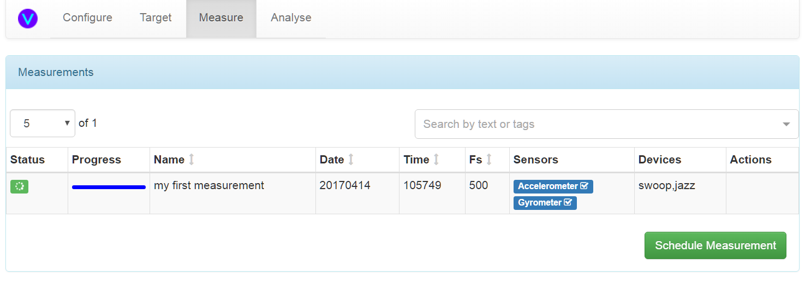

User Guide
==========

User Interface
--------------

The UI has 4 screens. A video demo is available on `youtube`_

Configure
^^^^^^^^^

The configure screen is split into 2 sections.

1) The **Measurement Devices** panel shows the currently connected sensors.
2) The **Target State** panel allows the user to change the current state of the system.

The system ensures that all sensors are kept in the same state based on the values set in the **Target State** pane.
The green checkboxes in the **Measurement Devices** panel indicate that the sensor is in the specified **Target State**.

Target
^^^^^^

The target screen allows the user to define target responses using 2 methods

1) Manually entered hinge points
2) WAV upload

Curves can be viewed and deleted using the buttons in each row.

Hinge Points
~~~~~~~~~~~~

1) Enter a name and at least 2 hinge points in dB<space>frequency format
2) click preview to examine the curve
3) click add to save it

WAV Upload
~~~~~~~~~~

1) Click the WAV button
2) Enter a name
3) Drag a mono wav file into the dropbox

4) The file will be uploaded, resampled to 1kHz if the sample rate is more than 1024Hz and converted into 3 curves (spectrum, psd, peak spectrum)

Measure
^^^^^^^

1) Click the **Schedule Measurement** button
2) Enter details in the dialog

3) Click Go! and click outside the modal to close it
4) The measurement should show as scheduled or in progress (depending on the delay entered)

5) The measurement should complete successfully and the time series data can be viewed using the chart button. Note you
can click the series names in the chart to show or hide the selected series. The data shown is either

* raw: the raw measured data
* tilt: low passed to isolate gravity and thus indicates the orientation of the sensor
* vibe: high passed to remove gravity and thus indicates the actual vibration

6) The measurement can be deleted using the dustbin icon

Handling Failed Measurements
~~~~~~~~~~~~~~~~~~~~~~~~~~~~

If the measurement fails for any reason, the status turns red. Tap the devices cell to bring up a table showing the reported reason for fail. There may not be a reason shown however, in which case you have to log onto the rpi and review the log files.

A common reason for failure is an overflow. This means the rpi was not able to read data from the FIFO fast enough.
This means you either need to reduce the sample rate or increase the rpi i2c bus speed.

Analyse
^^^^^^^

1) Select measurements and target curves via the dropdowns at the top of the screen
2) Click the play button to load data into the graph
3) Click the eject button to unload data from the graph
4) Click plus or minus to add a new dataset or remove an existing one

Note that the graph sets scales automatically according to the ranges of the selected data sets. The autoscaling can be overridden using the provided control.s

5) Select a reference series to show each selected measurement as a delta against that reference series

.. _youtube: https://youtu.be/pXOHOIwnnWw

